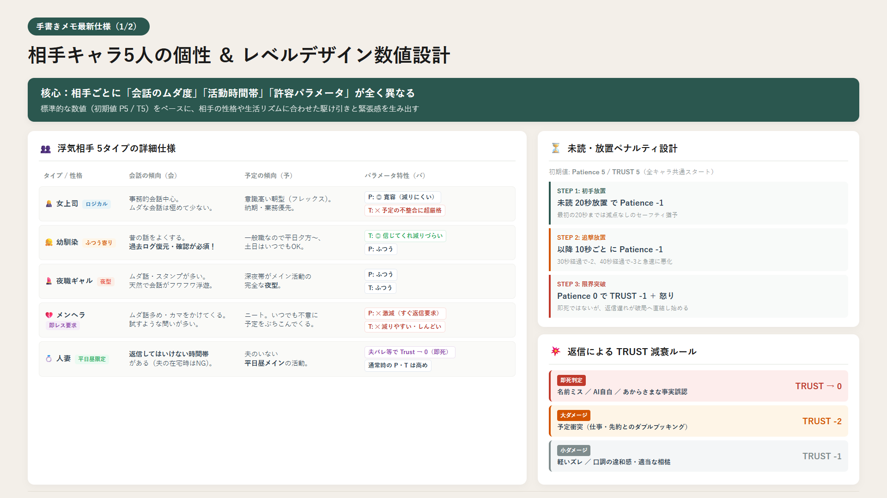
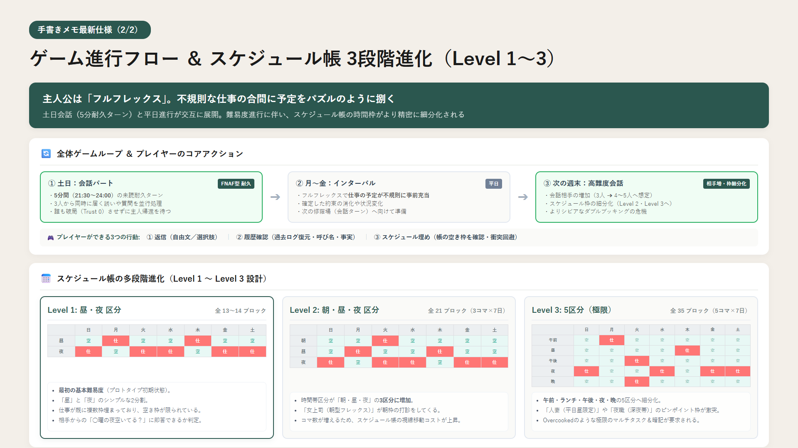
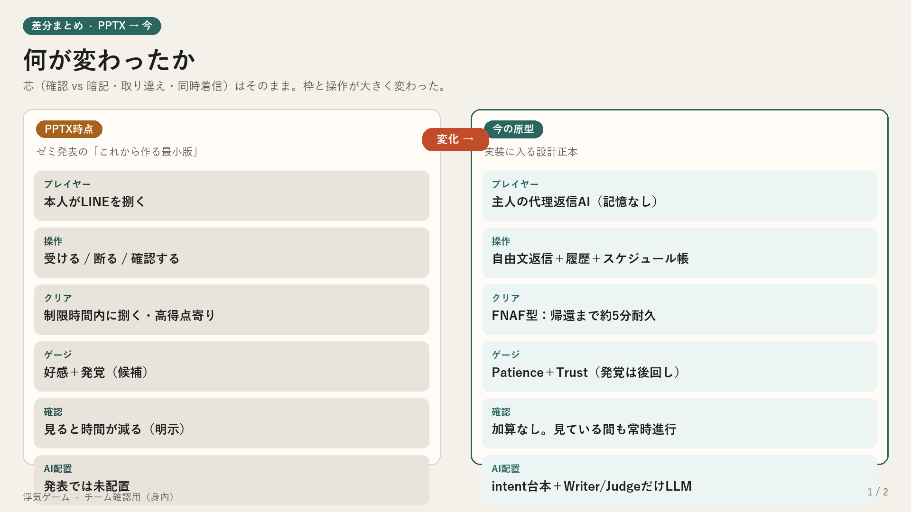
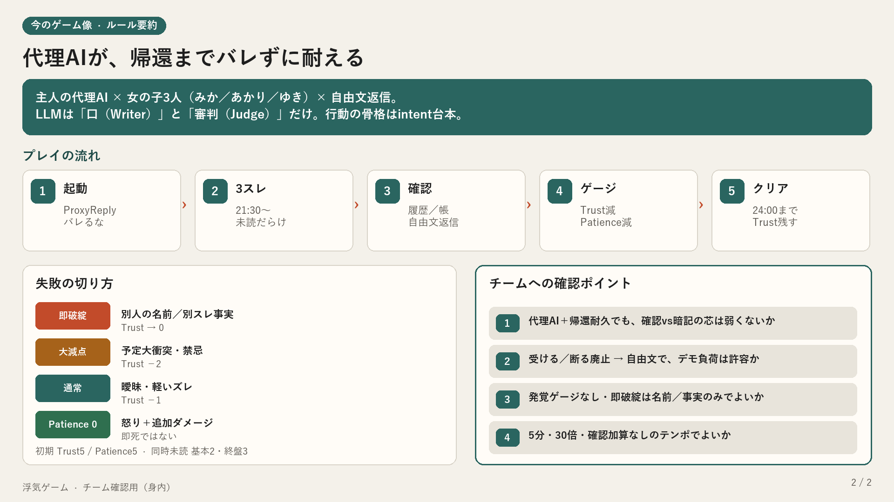

# 📱 浮気ゲーム（ProxyReply）レベルデザイン検証プロトタイプ

> **「バレるな。戻るまで頼む」**  
> 主人の代理返信AIとなり、複数の相手から届くLINEをさばきながら、主人帰宅（24:00）までバレずに耐え抜くマルチタスク・コミュニケーションゲーム。

---

## 🎮 今すぐブラウザでプレイ！
👉 **[浮気ゲーム Webプロトタイプをプレイする](https://gotoaoi0329.github.io/uwaki-game/)**  
*(PCブラウザ推奨 / インストール不要)*

---

## 📸 設計・仕様まとめスライド

### ① 相手キャラ5人の個性 ＆ レベルデザイン数値設計

### ② ゲーム進行フロー ＆ スケジュール帳 3段階進化

### ③ 前回復習：PPTXからの差分 ＆ ルール要約
| 差分まとめ | ルール要約 |
| :---: | :---: |
|  |  |

---

## 🕹️ ゲームのコアシステム

1. **基本ルール**:
   - FNAF型 5分間耐久（ゲーム内時間: 21:30 → 24:00、現実1秒＝ゲーム30秒、計300秒）
   - トーク相手は3人並行（女上司・幼馴染・夜職ギャル等）
   - **TRUST（信頼）** が 0 になると即ゲームオーバー（破局）。
   - **Patience（苛立ち）** は放置すると減少し、0になるとTRUST追加ダメージ＋怒りメッセージ。
2. **放置ペナルティ**:
   - 未読着信から **20秒放置で Patience -1**
   - 以降 **10秒ごとに Patience -1**
   - Patience 0 で **TRUST -1**
3. **ミス・減点判定**:
   - **即死 (-5)**: 他の女の子の名前で呼ぶ（名前ミス）、AIであることを自白する、あからさまな事実誤認
   - **大ダメージ (-2)**: スケジュール帳で仕事や先約が入っている枠を「空いてるよ」と承諾（予定衝突・二股発覚）
   - **小ダメージ (-1)**: 口調の不一致、曖昧な返信
4. **スケジュール帳（Level 1〜3）**:
   - 主人公はフルフレックス勤務。不規則に仕事の予定が入っている。
   - スケジュール帳を確認して空いている枠なら約束成立、埋まっているなら断る必要がある。
5. **レベルデザイン調整パネル**:
   - ゲーム中にリアルタイムで進行速度、着信頻度、放置猶予秒数、ダメージ量をスライダー変更可能。
   - プリセット（手書きメモ標準、ゆったり検証、修羅場、3倍速テスト）をワンクリック適用可能。

---

## 🤖 Gemini 生成AI機能（サーバー中継プロキシ連携）

本プロトタイプは **Google Gemini 1.5 Flash** と連携し、自由入力されたプレイヤーの返信をリアルタイムに解析・生成します。

- **Judge（地雷・予定判定）**:
  - 他キャラの名前呼び間違え、AI代理の自白を検知して即ゲームオーバー
  - スケジュール帳と照合し、埋まっている枠への承諾（二股発覚）や空き枠の約束成立を自動判定
- **Writer（キャラ口調返信生成）**:
  - 女上司（ロジカル・敬語混じり）、幼馴染（親密・昔話）、ギャル（テンション・スラング）の個性に合わせたリアルなLINE返信をリアルタイム生成
- **安心のフォールバック保護**:
  - 通信エラーやAPI制限（429）時は、自動でローカルのルールベースエンジンに切り替わりゲームが停止しません。

### 🚀 チームメンバー共有用の無料サーバー中継セットアップ（Vercel）
チームメンバー全員がAPIキーを入力せず、URLを開くだけでAI機能付きで遊べるようにするための手順です。

1. **Vercel にログイン**:
   - [Vercel](https://vercel.com) にアクセスし、GitHubアカウントでログインします。
2. **プロジェクトをインポート**:
   - `Add New...` → `Project` から本リポジトリ（`uwaki-game`）を選択して `Import`。
3. **環境変数 (Environment Variables) を追加**:
   - **Key**: `GEMINI_API_KEY`
   - **Value**: [Google AI Studio](https://aistudio.google.com/) で取得した API キー（`AIza...`）
4. **Deploy をクリック**:
   - 約30秒でデプロイが完了し、`https://uwaki-game-xxxx.vercel.app` が発行されます。
5. **メンバーにURLを共有**:
   - 発行された Vercel のURLをチームメンバーに送るだけで、キー不要でAIモードが遊べます！
   - ※ GitHub Pages（`https://gotoaoi0329.github.io/uwaki-game/`）から遊ぶ場合も、画面右上の「🤖 AI中継」タブに Vercel の URL（または `?proxy=https://your-app.vercel.app/api/chat`）を指定すれば連携可能です。

---

## 🛠️ ローカルでの起動方法
リポジトリをクローンまたはダウンロードし、`index.html`（または `浮気ゲーム.html`）をブラウザで開くだけで動作します。ローカルで直接AIを試したい場合は、「🤖 AI中継」タブからGemini APIキーを直接入力することも可能です。